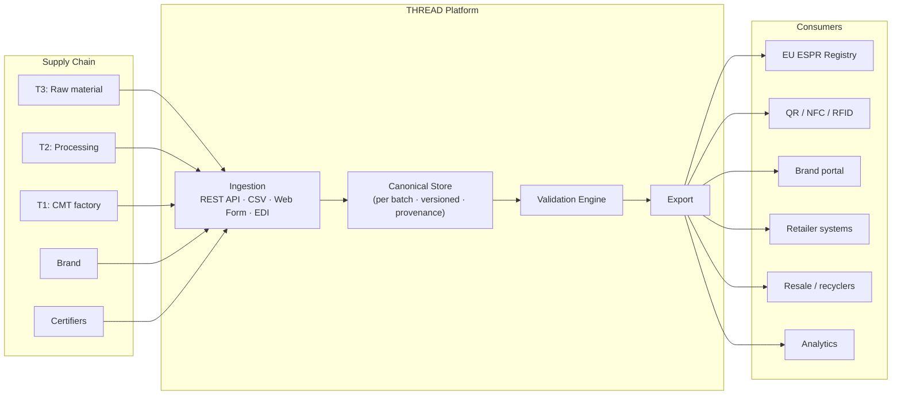
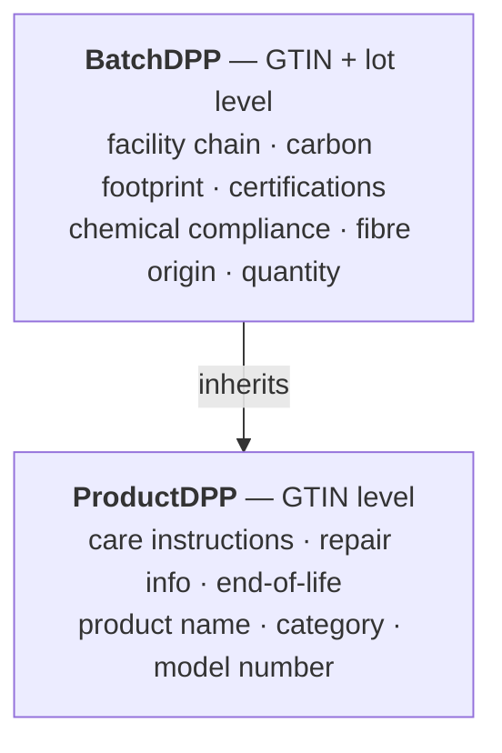

THREAD is structured as four layers: ingestion, canonical store, validation, and export. Each layer has a defined interface so that any component can be replaced or extended without affecting the others.

## System diagram



## Layers

### 1. Ingestion layer

Accepts data from supply chain participants in three formats. All formats are normalised to the canonical schema on ingress — adapters handle the mapping.

See [REST API](/integration/rest-api/), [File Upload](/integration/file-upload/), and [Web Form](/integration/web-form/) for details.

### 2. Canonical store

The central repository of batch DPP records. Each record is:

- **Scoped by tier** — each supplier only writes to their portion of the record; the brand assembles the complete DPP
- **Versioned** — updates create new versions; the full history is preserved and auditable
- **Annotated with provenance** — every field carries asserter identity, timestamp, and evidence reference
- **Identified by GS1** — GTIN + batch/lot as the primary key; Digital Link as the resolvable URI

### 3. Validation engine

Runs on every write and before publication. Checks:

- **Schema validity** — all required fields present and correctly typed
- **Business rules** — fibre percentages sum to 100%, production dates are logical, certification expiry is in the future
- **ESPR completeness** — all fields required by the EU ESPR regulation are populated
- **Cross-field consistency** — recycled content claims are consistent with material certifications

Validation results are returned to the submitter in real time, with field-level error references. Publication is blocked until ESPR-minimum completeness is achieved.

### 4. Export layer

Produces DPP data in formats required by consumers:

| Consumer | Format |
|---|---|
| EU ESPR Registry | JSON-LD (expected by delegated act) |
| QR code / NFC tag | GS1 Digital Link URL |
| Retailers / ERPs | REST API (JSON) |
| Legacy systems | EDIFACT / XML via AS2 adapter |
| Analytics | JSON Lines batch export |

## Data ownership model

THREAD uses a **federated ownership, centralised assembly** model:

- Each supply chain tier **owns and signs their data block**. A Tier-2 dyehouse sees and edits only their processing data; they cannot read Tier-1 or brand-layer data.
- The brand has **read access to all tiers** and is responsible for assembling and publishing the final DPP.
- Certifiers have a **write-only channel** to push verified certification status directly against a product or batch.
- Published DPPs are **immutable**. Corrections create a new version with a supersession link.

## Product vs. batch records



This avoids duplicating unchanging product data across hundreds of batches.

## Identifier resolution

A GS1 Digital Link URL encodes both the product and the batch:

```
https://id.{brand-domain}/01/{GTIN}/10/{BatchID}
```

Scanning this URL resolves — via GS1 resolver or a brand's own resolver — to the DPP record. The URL format is stable even as the underlying data evolves.
