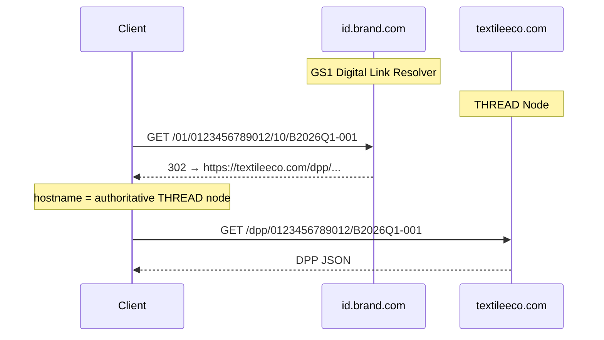

THREAD is an open standard. Multiple organisations can run THREAD-compliant platforms — TextileEco is the reference implementation, but a brand's in-house system, a competing SaaS platform, or a national DPP registry can all implement THREAD independently.

This raises a question: when a brand's DPP is on Platform A and their Tier-2 supplier uses Platform B, how does the data flow?

## The four interoperability problems

### 1. Resolution — finding the right DPP

When a retailer scans a QR code, or the EU registry looks up a product, they need to find the authoritative DPP regardless of which platform issued it.

**Solution: GS1 Digital Link resolver.**

The QR code payload is a GS1 Digital Link URL:

```
https://id.{brand-domain}/01/{GTIN}/10/{BatchID}
```

The brand's resolver (hosted by TextileEco or self-hosted) handles the redirect to the correct DPP endpoint. No platform-to-platform communication is needed — the resolver knows where the DPP lives.

When a brand migrates from one platform to another, they update their resolver. The QR codes on physical products remain unchanged.

---

### 2. Cross-platform reads — reading a DPP from another node

A retailer, auditor, or regulator may need to read a DPP hosted on a platform they don't have an account on.

**Solution: Standard public read endpoint.**

Every THREAD-compliant node must expose:

```http
GET https://{node-domain}/thread/v1/dpp/{gtin}/{batchId}
Accept: application/json
```

This returns the published DPP in canonical THREAD JSON. No authentication is required for published records — they are public by design.

For unpublished (draft) DPPs, the endpoint returns `404` to unauthenticated requests.

**Node discovery:**

The authoritative node for a given GTIN is identified via the GS1 Digital Link resolver. The redirect target's hostname is the authoritative node.



---

### 3. Supplier data portability — contributing across platforms

This is the most common federation scenario. A Tier-2 supplier uses Platform B (or their own THREAD-compliant system). The brand is on Platform A. The supplier's data needs to flow into the brand's DPP.

Two mechanisms handle this:

**Option A: Direct contribution via invite link (preferred for most suppliers)**

The brand generates a scoped invite link for the supplier. The supplier submits their data directly to the brand's platform via the web form or CSV upload — regardless of whether they also use another THREAD platform. The invite link works on any device, any platform.

This is the right path for the majority of suppliers, especially smaller ones. No platform-to-platform negotiation required.

**Option B: Portable signed data package (for suppliers managing their own data)**

A supplier on Platform B can export their data block as a **THREAD Portable Package** — a signed JSON document containing their tier's data and provenance attestation.

```json
{
  "threadPackage": "1.0",
  "gtin": "0123456789012",
  "batchId": "B2026Q1-001",
  "tier": "tier2",
  "data": {
    "manufacturing": [ ... ],
    "environmental": { ... },
    "compliance": { ... }
  },
  "provenance": [ ... ],
  "signature": {
    "issuer": "https://platform-b.textileeco.com",
    "issuedAt": "2026-04-21T10:00:00Z",
    "algorithm": "ES256",
    "value": "eyJ..."
  }
}
```

The supplier downloads this package from Platform B and submits it to Platform A via the REST API:

```http
POST /products/{gtin}/batches/{batchId}/import-package
Content-Type: application/json

{ ...portable package... }
```

Platform A verifies the package signature against the issuing node's public key (fetched from `https://platform-b.textileeco.com/.well-known/thread-keys.json`) and imports the data with provenance intact.

The resulting provenance entry records both the original supplier and the issuing node:

```json
{
  "field": "environmental.carbonFootprint",
  "assertedBy": { "id": "...", "name": "XYZ Dyehouse", "role": "tier2-supplier" },
  "issuedBy": "https://platform-b.textileeco.com",
  "evidenceType": "self-declared",
  "method": "portable-package"
}
```

---

### 4. EU registry submission — standardised format across all platforms

All THREAD-compliant platforms must be able to submit DPPs to the EU ESPR registry in the same format. The EU registry cannot require brands to use a specific platform.

**Solution: Standardised submission payload.**

The EU registry (once operational) will accept DPP submissions as JSON-LD documents. THREAD defines the mapping from its canonical schema to the registry submission format.

Every THREAD node exposes a registry-ready export:

```http
GET /products/{gtin}/batches/{batchId}/export/espr-registry
Accept: application/ld+json
```

This returns the DPP in JSON-LD format, ready to submit to the EU registry. The export format will be updated when the ESPR delegated act for textiles is finalised (expected 2026–2027).

---

## Node requirements

For a platform to be THREAD-compliant and federated, it must implement:

| Requirement | Endpoint / mechanism |
|---|---|
| Standard public read API | `GET /thread/v1/dpp/{gtin}/{batchId}` |
| Portable package export | `GET /products/{gtin}/batches/{batchId}/export/thread-package` |
| Portable package import | `POST /products/{gtin}/batches/{batchId}/import-package` |
| Public key discovery | `GET /.well-known/thread-keys.json` |
| ESPR registry export | `GET /products/{gtin}/batches/{batchId}/export/espr-registry` |
| GS1 Digital Link resolver | Hosted by the platform or delegated to the brand |

---

## What federation does not require

- **Server-to-server sync** — nodes do not replicate data between themselves. Data lives on one authoritative node and is read on demand.
- **Shared identity system** — each node manages its own user accounts. Supplier identity is verified at submission time via token scope; cross-node identity uses public key signatures.
- **Consensus or blockchain** — THREAD does not use a distributed ledger. The provenance log and immutability guarantees are enforced by each node independently.

---

## Relationship to UNTP

The UN Transparency Protocol (UNTP) uses W3C Verifiable Credentials as portable, self-verifying attestations. A UNTP Digital Conformity Credential is the conceptual equivalent of a THREAD Portable Package with cryptographic proof.

As UNTP matures, THREAD's portable package format will converge with UNTP's VC model. A UNTP-issued VC will be accepted as a valid `import-package` payload, and THREAD nodes will be able to issue UNTP-compatible VCs on export.
